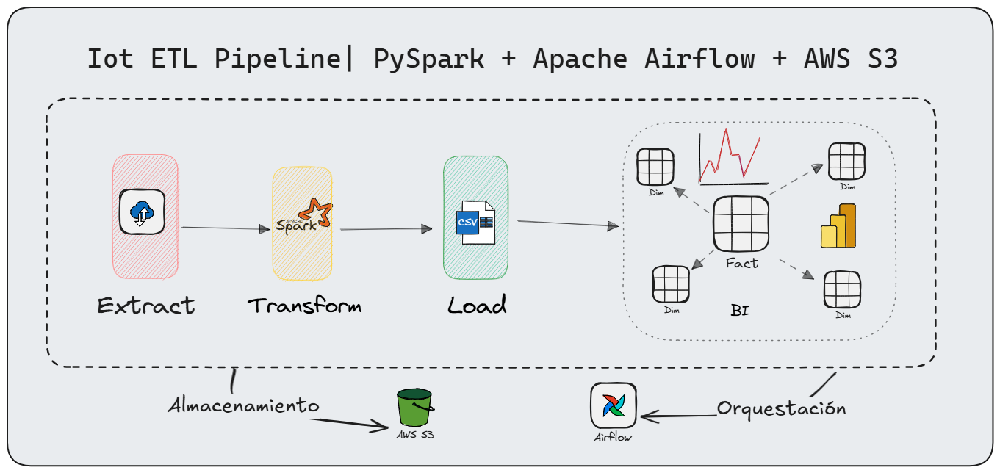
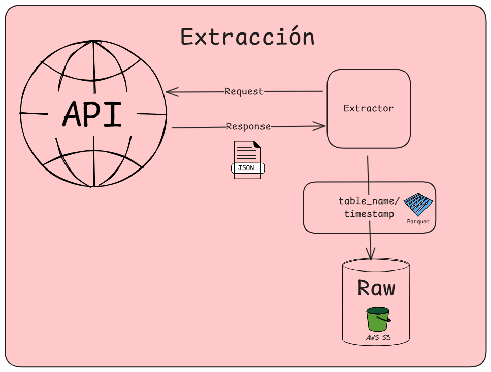
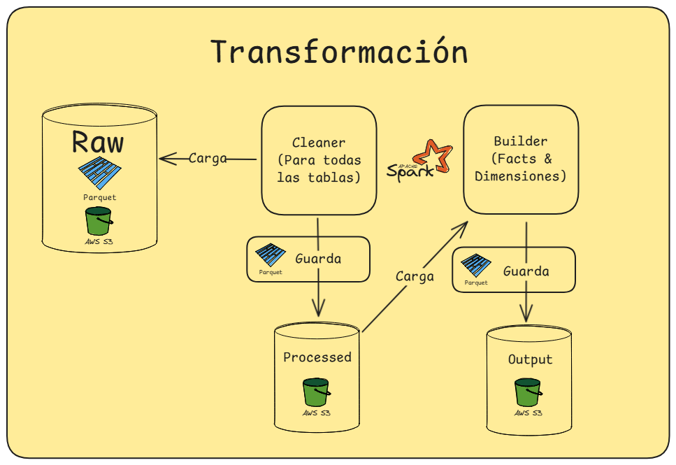
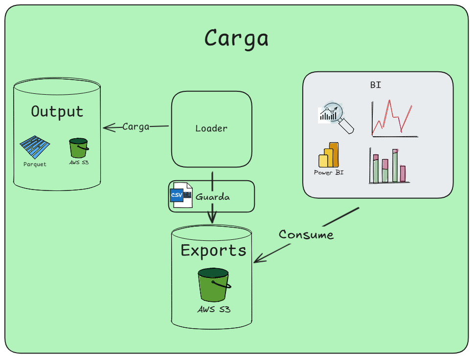

# Pipeline ETL - NexusForge Industries (IoT)

## Descripción General

Pipeline de datos para **NexusForge Industries**, empresa líder en manufactura inteligente que opera plantas de producción equipadas con sensores IoT industriales. El sistema procesa millones de lecturas de sensores por hora para alimentar dashboards ejecutivos y detectar anomalías en tiempo casi-real.

---

## Arquitectura y Esquema Dimensional

El pipeline alimenta a un modelo **estrella (star schema)** en S3, compuesto por:

- **Tablas de hechos**: fact_production, fact_quality, fact_maintenance, fact_alerts, fact_sensor_readings

- **Dimensiones**: dim_date, dim_time, dim_factory, dim_machine, dim_production_line, dim_product, dim_operator, dim_alert_type, dim_maintenance_type, etc.

**Flujo de datos:**

1. **Extract**: Descarga datos crudos desde una API industrial (JSON), incluyendo órdenes, sensores, alertas, mantenimientos, etc.

2. **Transform**: Limpia, valida y modela los datos usando PySpark. Se generan dimensiones y hechos, aplicando reglas de negocio y asegurando calidad e integridad referencial.

3. **Load**: Exporta los resultados finales a archivos CSV y Parquet en S3, listos para consumo analítico o integración con BI.

---

## Orquestación y Almacenamiento

- **Almacenamiento**: Todos los datos (raw, processed, output) se almacenan en S3, permitiendo escalabilidad y bajo costo.
- **Procesamiento**: Se utiliza **PySpark** para procesamiento distribuido y manejo de grandes volúmenes.
- **Orquestación**: **Apache Airflow** ejecuta y monitorea el pipeline de manera programada y reproducible (DAGs).
- **Contenerización**: Todo el pipeline corre en Docker, asegurando portabilidad y fácil despliegue.

---

## Documentación Detallada

Para profundizar en la operación, despliegue y arquitectura del pipeline, consulta:

- [docs/getting-started.md](docs/getting-started.md): Guía de inicio rápido y ejecución local/orquestada.
- [docs/etl-docker.md](docs/etl-docker.md): Uso de Docker para desarrollo, pruebas y despliegue.
- [docs/orchestration-docker.md](docs/orchestration-docker.md): Orquestación avanzada con Airflow y mejores prácticas.
- [docs/star-schema.md](docs/star-schema.md): Explicación detalladas de las tablas presentes en el esquema estrella alimentado.

---

## Operación, Logros y Beneficios

- **Escalabilidad**: Procesa millones de registros/hora gracias a PySpark y S3.
- **Calidad de datos**: Limpieza robusta, validación y reglas de negocio implementadas.
- **Automatización**: Orquestación con Airflow y ejecución reproducible vía Docker.
- **Trazabilidad**: Versionado de datos y logs de ejecución accesibles.
- **Flexibilidad**: Fácil extensión del modelo dimensional y de las fuentes de datos.

---

**Autor:** Gerardo Toboso · [gerardotoboso1909@gmail.com](mailto:gerardotoboso1909@gmail.com)

**Licencia:** MIT